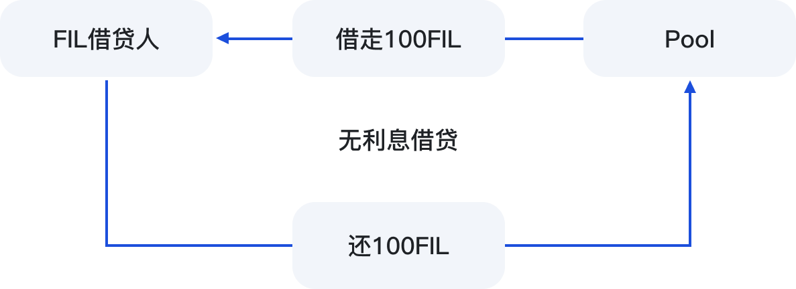

# 📈 借贷

<figure><figcaption></figcaption></figure>

#### 1. 操作与条件

借贷功能的上线，为用户提供：杠杆质押挖矿；灵活资金需求

第一步：SFT持有者需要将SFT质押到6个月定期农场中。

第二步：根据质押SFT的数量，来借贷FIL的数量。

#### 2. 借贷系数：

最大的借贷系数60%，用户可以根据自己需求，不超过60%进行条件。在未满60%的最大系数情况下，可多次FIL借贷。

#### 3. 利息计算：

借款用户无需支付任何利息，举个例子，用户借走了100FIL，归还的时候，只需要归还100个FIL。

<figure><figcaption></figcaption></figure>

#### 4. 借贷FIL被抵押的SFT权益说明：

用户借贷FIL，抵押了SFT，那么该部分SFT的挖矿收益权，将会被转移到Pool池子中。举例说明：

> Bob将自己1000个SFT按照60%向借贷池借出了600个FIL。Bob还款的时候，无需支付额外的利息，只要归还600个FIL，无时间限制。
>
> 但是，Bob的原本1000SFT的收益权被削减到了400个，600SFT的收益权，将会被分配到Pool池当中，直到Bob归还了600个FIL借款，合约将重新释放600SFT的收益权。

\
