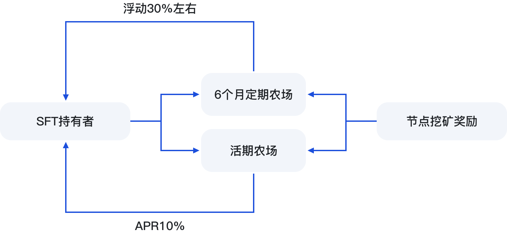

# 💰 农场


SFT Protocol构建了Farm农场，当前的农场分为6个月定期质押和活期质押。


<figure><figcaption></figcaption></figure>

#### **1. 6个月定期农场：**

将SFT质押到该6个月定期质押池中，年化收益率20%-35%的每日浮动收益，每日设备节点奖励的FIL，按照与设备提供商的5:5分配比例，转入到Farm池中，用户可以每日领取。质押的SFT，需要6个月到期以后才可以解锁。

#### **2. 活期农场：**

固定收益年化10%，随时可以赎回SFT，无时间限制。

\
