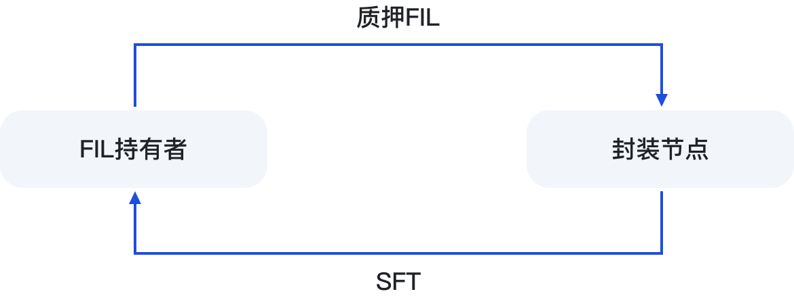

# 🔨 质押铸造SFT

<figure><figcaption></figcaption></figure>

用户质押FIL到节点后，合约自动铸造SFT，是按照1:1进行。当用户使用SFT对FIL进行赎回操作，SFT将会被销毁。

SFT是FIL持有者，参与节点挖矿的算力凭证，该凭证将获得节点享有的收益权。SFT可以通过钱包进行转移，转移后，收益权也随着转移。

#### 更多内容信息，可查看链接：

[https://sftcn.medium.com/sft-%E5%8D%8F%E8%AE%AE-2-0-%E6%B7%B1%E5%BA%A6%E8%A7%A3%E6%9E%90-%E4%B8%80-%E6%8E%A2%E7%A9%B6-sft-%E9%93%B8%E9%80%A0%E4%B8%8E-fil-%E8%B5%8E%E5%9B%9E%E7%9A%84%E6%9C%BA%E5%88%B6-bbf53db78515](https://sftcn.medium.com/sft-%E5%8D%8F%E8%AE%AE-2-0-%E6%B7%B1%E5%BA%A6%E8%A7%A3%E6%9E%90-%E4%B8%80-%E6%8E%A2%E7%A9%B6-sft-%E9%93%B8%E9%80%A0%E4%B8%8E-fil-%E8%B5%8E%E5%9B%9E%E7%9A%84%E6%9C%BA%E5%88%B6-bbf53db78515)

\
