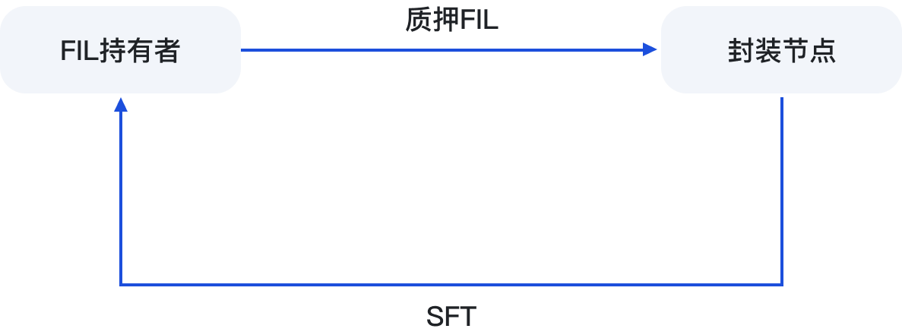

# 🤝 FIL 持有者

## 1. 质押FIL到封装节点，获取高收益

用户可以在BSC和Filecoin的FVM上，在Mint页面中，使用FIL进行质押到封装节点，链上合约将会铸造出同等数量的SFT(活动期间)，参与节点联合挖矿。FIL持有者与设备提供商，双方5:5共享挖矿收益。

质押教程：[zhi-ya-fil-dao-feng-zhuang-jie-dian](../jiao-cheng/chan-pin-cao-zuo-jiao-cheng/zhi-ya-fil-dao-feng-zhuang-jie-dian/ "mention")

<figure><figcaption></figcaption></figure>

## 2. 质押FIL到Pool流动池中

FIL持有者，提供流动性到Pool池中，赚取FIL币本位APY10%-58%的收益，用户可以通过持有rSFT，实时赎回自己提供的FIL。


什么是Pool？SFT Protocol在Filecoin的FVM上推出的流动性质押和杠杆挖矿流动性池。它使 $FIL 代币持有者能够在没有锁定期的情况下获得稳定的收益，并为FIL需求者提供流动性借贷。


FIL流动性提供教程：[ru-he-zhi-ya-fil-dao-pool-liu-dong-chi.md](../jiao-cheng/chan-pin-cao-zuo-jiao-cheng/ru-he-zhi-ya-fil-dao-pool-liu-dong-chi.md "mention")\

<figure><figcaption></figcaption></figure>
