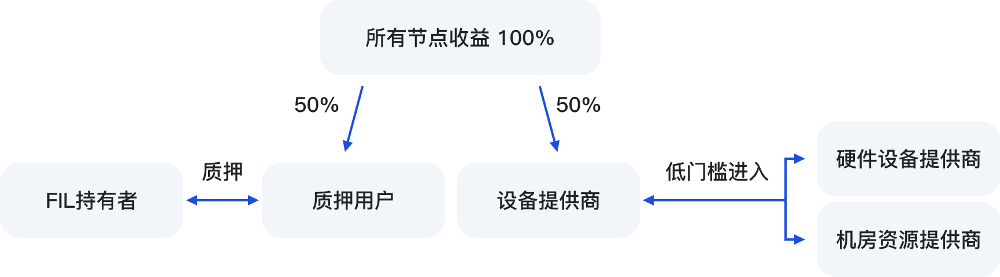

# 🛡 设备提供商


设备提供商：提供设备或者机房的合作商，无需懂得挖矿技术的客户，无需设备维护。SFT Protocol将帮助合作商进行设备管理，为他们提供高质量的技术服务，帮助他们建设和参与DePIN，并按照合同进行利润分成。


<figure><figcaption></figcaption></figure>

SFT协议期望构建使用SFT协会通证代币SPD，来启用SFT大规模的无需许可、无需信任和可编程的物理基础设施和硬件网络。

通过SFT加密经济协议，SPD能够激励供应方参与网络建设，为终端用户提供比传统模式更具成本效益和创新性的服务。

期望未来，吸引更多的设备机房商，来扩大规模，而设备商不需懂得Filecoin技术，我们有非常成熟的服务团队。

商务合作请联系我们： [lian-xi-wo-men.md](../xie-yi/lian-xi-wo-men.md "mention")
