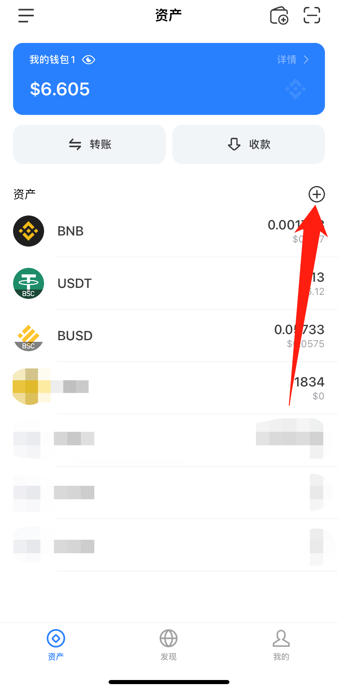
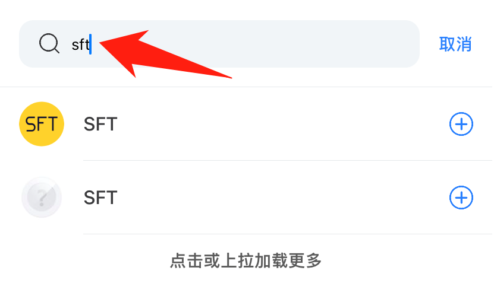
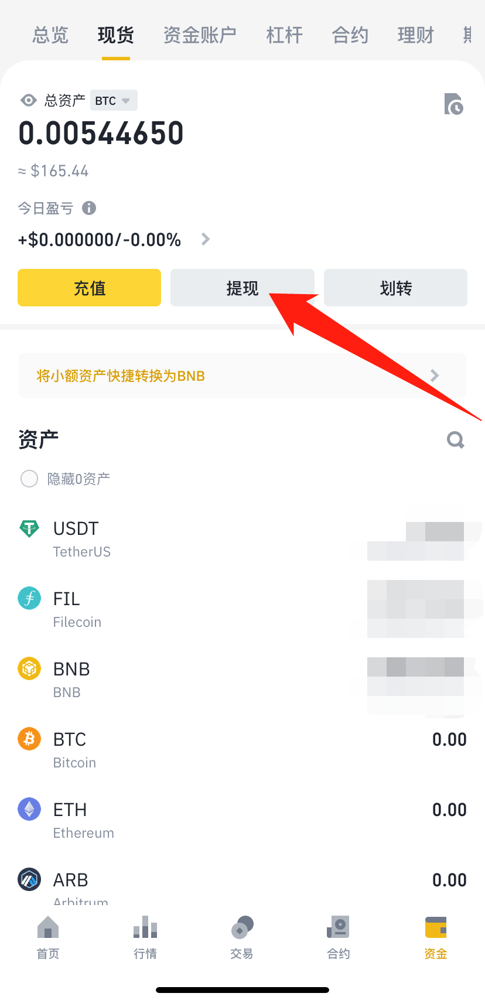
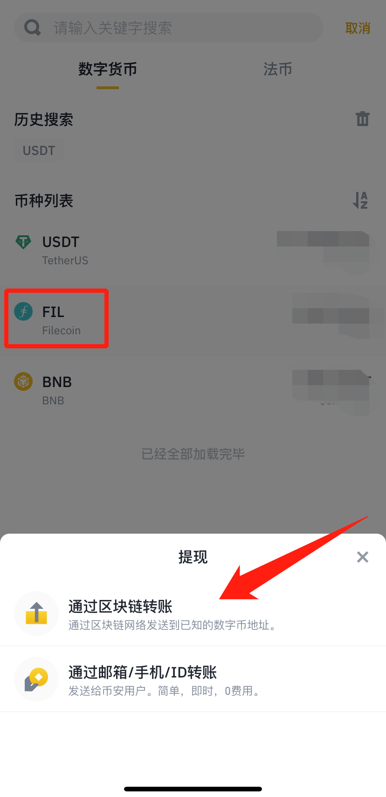
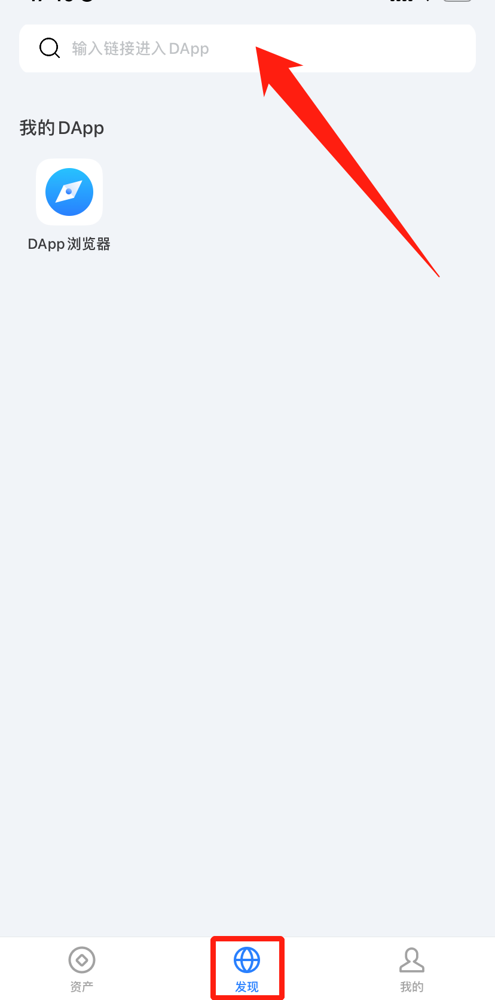
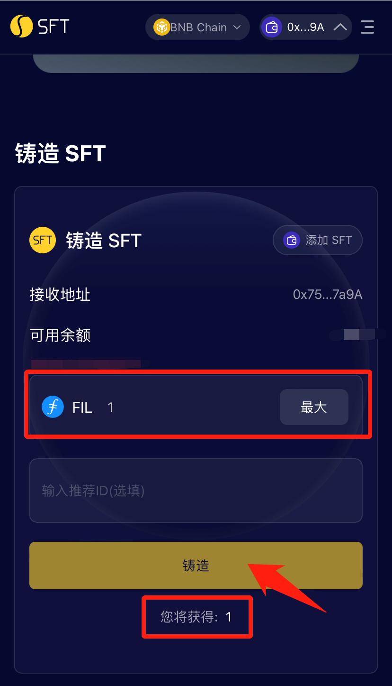

# BSC-质押流程


TP Wallet是一个流行的去中心化加密钱包，拥有数百万用户。该钱包支持BSC和Filecoin FVM，用户可使用TP Wallet轻松参与SFT Protocol。本教程基于TP Wallet手机版本。


#### 1、在手机上下载TP Wallet：[https://www.tokenpocket.pro/zh/download/app](https://www.tokenpocket.pro/zh/download/app)，根据手机型号进入安卓或IOS版本的下载链接。

<figure><figcaption></figcaption></figure>

#### 2、打开TP Wallet切换到BSC网络，创建新钱包或导入钱包。

.png>).png>)

#### 3、点击加号，添加资产到钱包中。搜索SFT和rSPD，点击右侧加号即可添加。

#### 4、使用交易所，可将FIL提取到TP Wallet的0x地址。Filecoin官方有支持的中心化交易所列表，实时更新：[https://filecointldr.io/get-fil](https://filecointldr.io/get-fil)

①比如在币安购买了FIL。

②在钱包中复制0x开头的地址后，参考下图提取FIL。

 

③粘贴0x开头的地址，选择BSC链，输入提现金额。

④点击提现后，按照交易所步骤确认即可。

#### 5、使用钱包浏览器打开SFT协议，粘贴链接：[https://www.sftproject.io/](https://www.sftproject.io/)。

#### 6、点击右侧三条横线，在箭头处切换语言。

.png>)

#### 7、点击【立即质押】，即可使用SFT协议在FVM上质押FIL（FIL≥0.1个），获得SFT。目前铸造费率补贴活动进行中，质押1个FIL可立即获得1个SFT，0 gas费。

