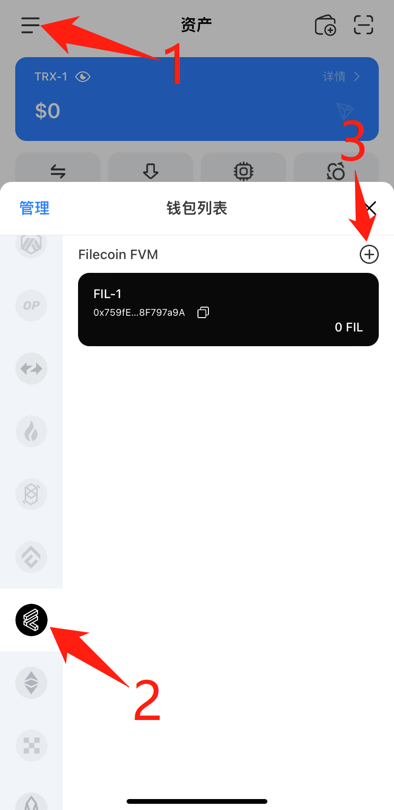
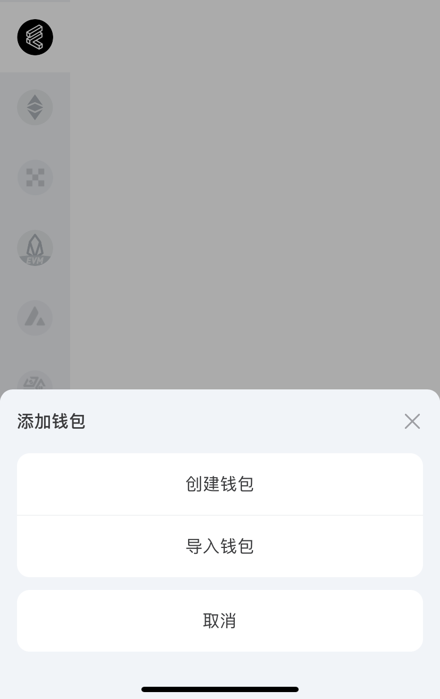
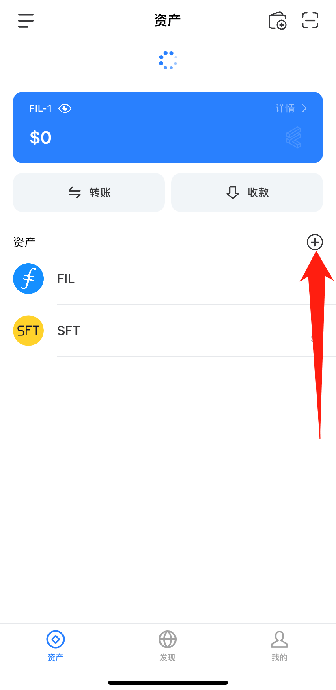
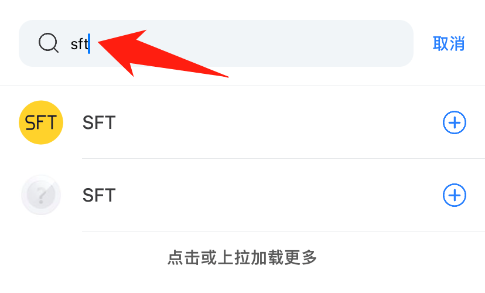
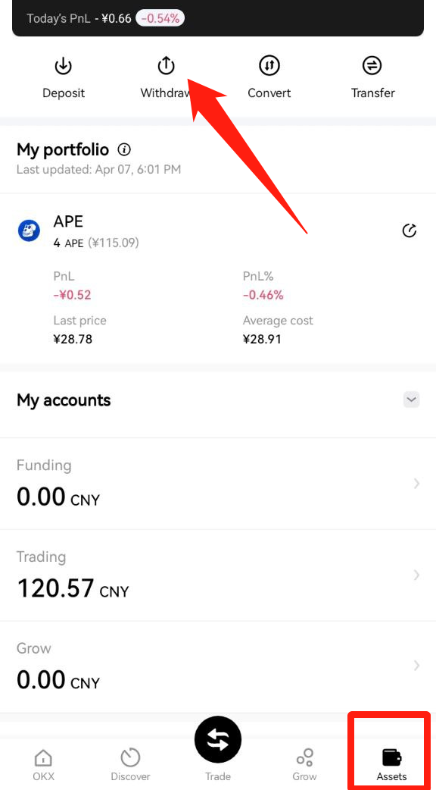
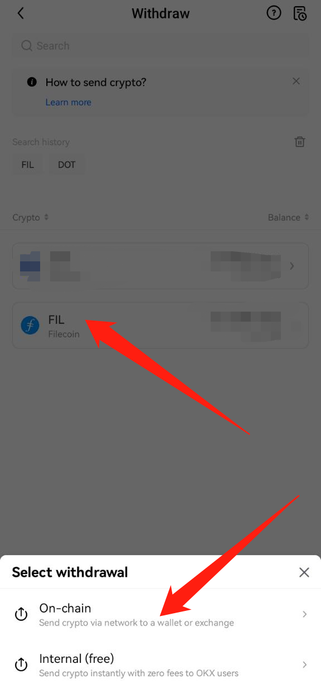
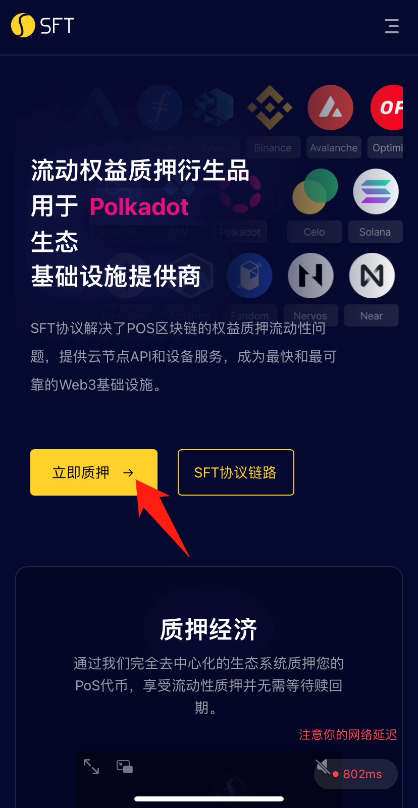
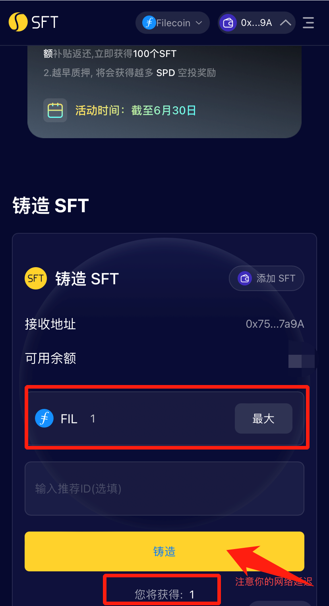

# FVM


TP Wallet是一个流行的去中心化加密钱包，拥有数百万用户。目前该钱包支持Filecoin FVM，用户可使用TP Wallet轻松加入Filecoin 2.0。本教程基于TP Wallet手机版本。


#### 1、在手机上下载TP Wallet：[https://www.tokenpocket.pro/zh/download/app](https://www.tokenpocket.pro/zh/download/app)，根据手机型号进入安卓或IOS版本的下载链接。

<figure><figcaption></figcaption></figure>

#### 2、打开TP Wallet切换到FVM网络，创建新钱包或导入钱包。

#### 3、点击加号，添加资产到钱包中。搜索SFT和rSPD，点击右侧加号即可添加。

 

&#x20;

#### 4、使用交易所，可将FIL提取到TP Wallet的0x地址。Filecoin官方有支持的中心化交易所列表，实时更新：[https://filecointldr.io/get-fil](https://filecointldr.io/get-fil)

①比如在OKX交易所购买FIL

②在钱包中复制0x或者f4开头的地址后，参考下图提取FIL

 

③粘贴复制好0x或f4开头的钱包地址，如下图所示

.png>)

&#x20;④按照交易所步骤确认提现到钱包

#### 5、使用钱包浏览器打开SFT协议，粘贴链接：[https://www.sftproject.io/](https://www.sftproject.io/)。

.png>)

#### 6、点击右侧三条横线，在箭头处切换语言。

.png>)

&#x20;

#### 7、点击【立即质押】，即可使用SFT协议在FVM上质押FIL（FIL≥0.1个），获得SFT。目前铸造费率补贴活动进行中，质押1个FIL可立即获得1个SFT，0 gas费。

&#x20;
