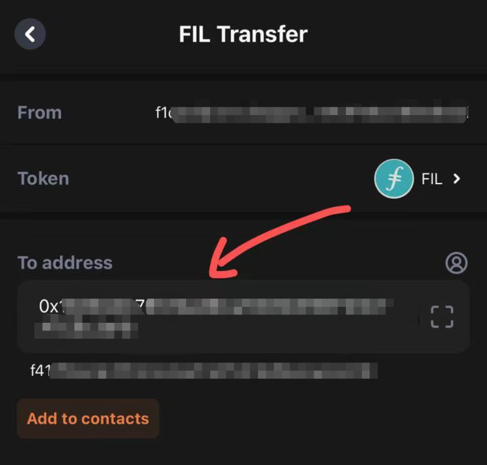

# FEVM地址说明


FEVM地址是 0x或f4地址开头的地址。因此，要将Filecoin本链f1开头的地址，转入到0x或f4开头的FEVM地址上，才能参与SFT Protocol相关DAPP应用。


## 如何将 FIL 转账到 0x/f4 钱包?

#### 1、使用交易所的方法

使用欧易OKX交易所，完全支持0x/f4钱包[​](https://docs.stfil.io/docs/guides/fevm/transferto0xf4wallet#okx-exchange-fully-supports-0xf4-wallet)：（推荐使用[TP钱包](https://www.tokenpocket.pro/zh/download/app)）

* 从其他交易所/硬件钱包转移到OKX交易所。
* 从OK欧易交易所转移到MetaMask或者TP钱包的**0x/f4**地址。

#### 2、使用钱包的方法

使用 SFT Protocol 战略合作伙伴[FoxWallet](https://foxwallet.com/)进行转移：

* 安装FoxWallet应用程序[​](https://docs.stfil.io/docs/guides/fevm/transferto0xf4wallet#install-foxwallet-app)FoxWallet下载链接：[https://foxwallet.com/](https://foxwallet.com/)
* 安装完成后，在FIL转账页面，可以直接输入 0x/f4地址，进行目标地址的转账。

<figure><figcaption></figcaption></figure>
