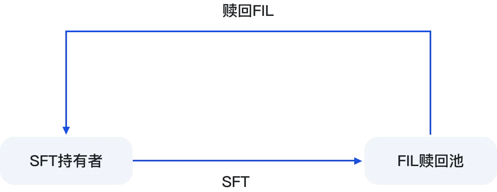

# 如何使用SFT赎回FIL

#### &#x20;     如果教程依然没有能够帮助到您，您还可以进入社群，联系社区管理员，24小时为您解答，使用过程的任何问题。**Telegram 中文:** [**https://t.me/SFTChinese**](https://t.me/SFTChinese)

持有SFT代币的用户可以通过SFT协议2.0的赎回页面进行实时赎回FIL操作。整个过程无时间限制，无手续费。赎回的比例是1:1，例如，使用100个SFT，可以赎回100个FIL

<figure><figcaption></figcaption></figure>

### **赎回网络** 

SFT协议2.0目前的赎回网络位于Filecoin — — FVM，未来将扩展到BSC网络。对于当前在BSC网络的SFT地址，用户需要通过SFT跨链桥将SFT跨链到FVM上，然后进行赎回操作。赎回的FIL将会是FVM上的FIL。

<figure><figcaption></figcaption></figure>

### 具体操作图片教程

1.申请代币SFT转账授权

2.确认交易

赎回成功，在地址钱包查看。
