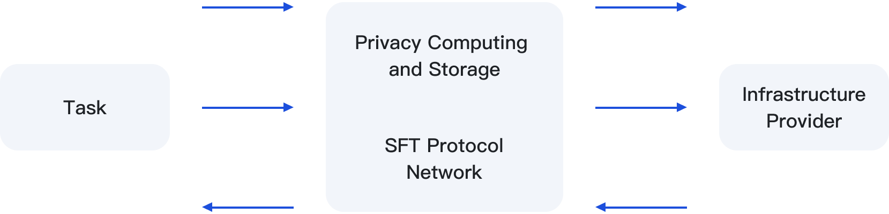

# 技术架构

SFT Protocol 在Filecoin和BSC区块链之上实现了一组去中心的智能合约。智能合约保证安全，不需要中间人。

<figure><figcaption></figcaption></figure>

<figure><figcaption>
SFT Protocol RPC
</figcaption></figure>

<figure><figcaption></figcaption></figure>

<figure><figcaption></figcaption></figure>

<figure><figcaption></figcaption></figure>

<figure><figcaption></figcaption></figure>
