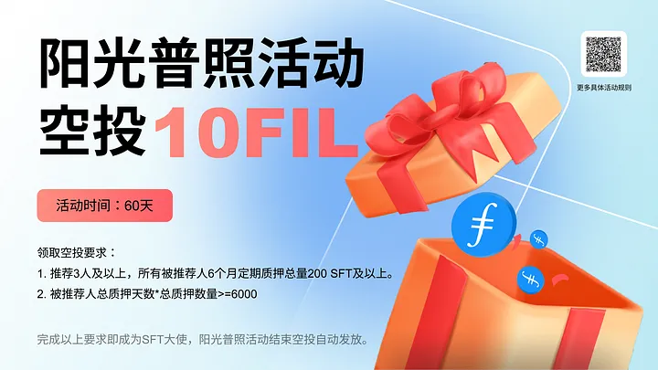

# 🎁 🎁SFT大使推广计划：加入获取每日$FIL空投

<figure><figcaption></figcaption></figure>

## _一、阳光普照奖励活动（空投10 $FIL）_ 

**活动奖励：**10 $FIL（所有大使均可获得）

**活动时间：**60 天

**奖励发放：**活动结束统一发放至大使本人地址

**规则说明：**

1\. 活动期间**被推荐人总质押天数\*总质押数量≥6000。**

2\. 阳光普照活动结束所有SFT大使都将获得10 $FIL空投，活动结束各星级大使身份仍继续存在，且每日被动推荐收益仍持续。

3\. SFT星级大使（一星至五星大使为星级大使）的推荐收益每日持续发放，直到被推荐人质押的SFT解锁完。

<figure><figcaption></figcaption></figure>

## _二、 大使推荐奖励及任务说明_ 

## _普通大使_ 

1. **基础奖励**

被推荐人填写推荐ID及链接，大使即获得被推荐人6个月Farm定期质押对应比例的rSPD奖励。

2\. **获得被推荐人每日收益加成比例：0%**

普通大使无$FIL收益加成，但可享受阳光普照活动的10$FIL奖励。

3\. **任务要求**

推荐3人及以上，所有被推荐人6个月定期质押总量200 SFT及以上。

## _**一星大使**_ 

1. **基础奖励**

被推荐人填写推荐ID及链接，大使即获得被推荐人6个月Farm定期质押对应比例的rSPD奖励。

2\. **获得被推荐人每日收益加成比例：3%**

大使将获得所有被推荐人每日收益3%的$FIL奖励。此奖励每日可领取，直到被推荐人质押的SFT解锁完

3.**任务要求**

（1）大使本人地址拥有完整**SFT铸造及FIL池流动性**提供交互记录。

（2）推荐3人及以上。

（3）所有被推荐人6个月Farm定期总质押量1000 SFT及以上 。

## _二星大使_ 

1. **基础奖励**

被推荐人填写推荐ID及链接，大使即获得被推荐人6个月Farm定期质押对应比例的rSPD奖励。

2\. **获得被推荐人每日收益加成比例：6%**

大使将获得所有被推荐人每日收益6%的$FIL奖励。此奖励每日可领取，直到被推荐人质押的SFT解锁完

3.**任务要求**

（1）大使本人地址拥有完整**SFT铸造及FIL池流动性**提供交互记录。

（2）推荐5人及以上。

（3）所有被推荐人6个月Farm定期总质押量5000 SFT及以上 。

## _三星大使_ 

1. **基础奖励**

被推荐人填写推荐ID及链接，大使即获得被推荐人6个月Farm定期质押对应比例的rSPD奖励。

2\. **获得被推荐人每日收益加成比例：10%**

大使将获得所有被推荐人每日收益10%的$FIL奖励。此奖励每日可领取，直到被推荐人质押的SFT解锁完

3.**任务要求**

（1）大使本人地址拥有完整**SFT铸造及FIL池流动性**提供交互记录。

（2）推荐10人及以上。

（3）大使本人6个月Farm**定期质押总质押量**500 SFT及以上

（4）所有被推荐人6个月Farm定期总质押量30,000 SFT及以上 。

## _四星大使_ 

1. **基础奖励**

被推荐人填写推荐ID及链接，大使即获得被推荐人6个月Farm定期质押对应比例的rSPD奖励。

2\. **获得被推荐人每日收益加成比例：15%**

大使将获得所有被推荐人每日收益15%的$FIL奖励。此奖励每日可领取，直到被推荐人质押的SFT解锁完

3.**四星大使专属奖励加成**

40%加成权益券1份，针对大使本人新创建的质押订单。

4.**任务要求**

（1）大使本人地址拥有完整**SFT铸造及FIL池流动性**提供交互记录。

（2）推荐20人及以上。

（3）大使本人6个月Farm**定期质押总质押量**500 SFT及以上

（4）所有被推荐人6个月Farm定期总质押量100,000 SFT及以上 。

## _五星大使_ 

1. **基础奖励**

被推荐人填写推荐ID及链接，大使即获得被推荐人6个月Farm定期质押对应比例的rSPD奖励。

2\. **获得被推荐人每日收益加成比例：20%**

大使将获得所有被推荐人每日收益20%的$FIL奖励。此奖励每日可领取，直到被推荐人质押的SFT解锁完

3.五**星大使专属奖励加成**

60%加成权益券1份，针对大使本人新创建的质押订单。

4.**任务要求**

（1）大使本人地址拥有完整**SFT铸造及FIL池流动性**提供交互记录。

（2）推荐50人及以上。

（3）大使本人6个月Farm**定期质押总质押量**500 SFT及以上

（4）所有被推荐人6个月Farm定期总质押量300,000 SFT及以上 。

## _**三、四星及五星大使专属福利说明**_ 

<figure><figcaption></figcaption></figure>

## _**订单质押加成收益券**_ 

该奖励为4星和5星大使专属福利，当大使完成星级升级，比如达到4星或5星，该收益券自动发放，并显示在质押页面。

## _**加成收益券使用说明**_ 

1. **唯一性**

该券为一次性使用，不可转让，与大使本人地址绑定。

**2.使用场景**

该加成收益券成为四星或五星大使时自动发放，大使本人地址在新创建一笔SFT质押订单时可使用该权益券。

**3.如何加成**

使用该权益券只针对**单笔新质押SFT订单**，在农场质押SFT，将会在原本的质押每日收益的基础上，额外加成收益：4星大使为40%，5星大使为60%。

**4.不可同时存在**

该40%、60%的加成收益券不可同时存在。

**解释说明：**成为四星大使后，大使立即获得40%的加成权益，如果未在SFT质押过程中使用，又升级到了5星大使，大使将立即获得60%的加成收益券，之前40%的未使用的加成权益作废，当前大使本人仅有一张60%的加成收益券。如果四星大使已使用过一次40%的收益券，随后又升级到了五星大使，大使本人依然可以获得60%的收益券。

**5.加成数量上限**

四星及五星大使使用加成收益券时，享受加成收益的SFT数量上限为所有被推荐人质押总量的20%。

例如：

5星大使的所有被推荐人质押总量为30万个SFT。那么在5星大使本人进行新订单SFT质押时，最大可对6万个SFT进行收益加成。这个6万个SFT，将获得额外60%的收益加成。

如果该五星大使使用60%加成收益券质押10万个SFT，但是推荐他人质押总量只有30万个SFT，那么只加成6万个SFT收益，剩余的4万个SFT将不享受60%的收益加成。
