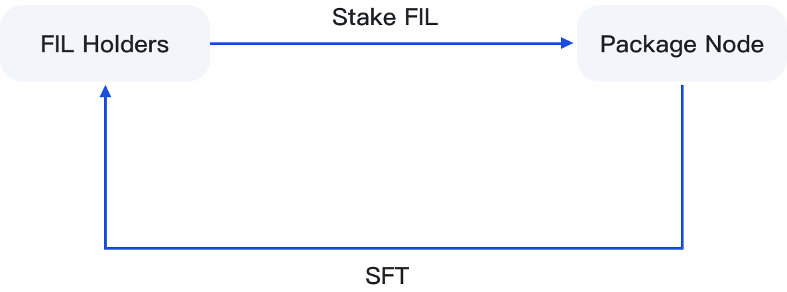
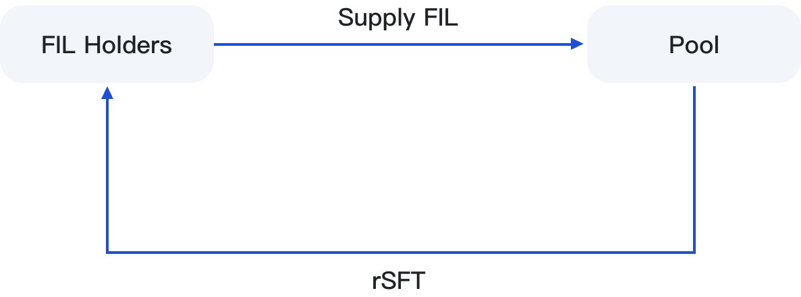

# 🤝 FIL Holders

### 1. Staking FIL to the Sealing Nodes to earn high yields

Users can stake FIL to the Sealing Nodes on BSC and Filecoin's FVM through the Mint page. The on-chain contract will mint the same amount of SFT (during the activity period) and participate in the joint mining of the nodes. FIL holders and equipment providers share the mining revenue 5:5.

Staking tutorial: To be opened...

<figure><figcaption></figcaption></figure>

### 2. Staking FIL to the Pool Liquidity Pool

FIL holders can provide liquidity to the Pool pool and earn APY10%-58% in FIL. Users can redeem their staked FIL in real time through holding rSFT.


What is Pool?

Pool is a liquidity staking and leveraged mining liquidity pool launched by SFT Protocol on Filecoin's FVM. It allows FIL token holders to earn stable income without locking period and provides liquidity borrowing for FIL demanders.


FIL Liquidity Tutorial: To be opened...\

<figure><figcaption></figcaption></figure>
