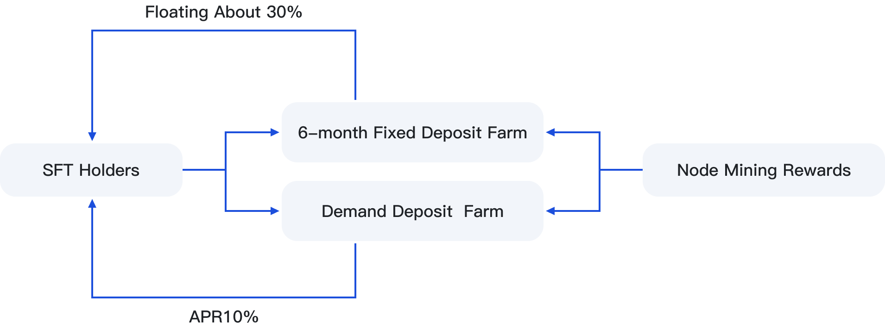

# 💰 Farm


SFT Protocol has built a Farm farm, which is currently divided into fixed-term and current deposit farming.


<figure><figcaption></figcaption></figure>

### **1.** Fixed-term Farm

The SFT is pledged to the fixed-term deposit pool for six months, with a daily floating yield of 20%-35% and daily equipment node rewards of FIL, which are distributed to the Farm pool in a 5:5 ratio with the equipment provider. Users can receive them daily. The pledged SFT will need to be unlocked after six months.

### **2.** Demand Deposit Farm

Fixed income annualized at 10%, SFT can be redeemed at any time without time limit.

\
