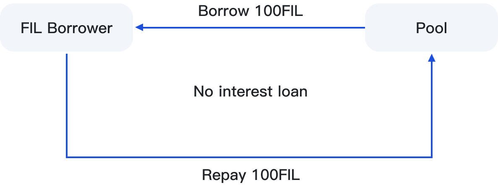

# 📈 Lending

<figure><figcaption></figcaption></figure>

## 1. Operation and Conditions

The launch of the lending function provides users with leverage stake mining and flexible capital needs.

* Step 1 - SFT holders need to stake SFT to the fixed-term farm for six months.
* Step 2 - Borrow FIL according to the amount of staked SFT.

## 2. Loan-to-Value Ratio

The maximum loan-to-value ratio is 60%. Users can borrow FIL based on their own needs, not exceeding 60%. Under the maximum ratio of less than 60%, FIL can be borrowed multiple times.

## 3. Interest Calculation

The borrower does not need to pay any interest. For example, if the user borrows 100 FIL, only 100 FIL needs to be repaid when returning.

<figure><figcaption></figcaption></figure>

## 4. Explanation of SFT equity staked for borrowing FIL

When the user borrows FIL and stakes SFT, the mining revenue rights of that part of SFT will be transferred to the Pool pool.&#x20;

> For example, Bob staked 1000 SFT to borrow 600 FIL according to 60%. When Bob repays the loan, he only needs to repay 600 FIL without paying additional interest. However, Bob's original 1000 SFT revenue right will be reduced to 400, and the revenue right of 600 SFT will be allocated to the Pool pool until Bob repays the 600 FIL loan, and the contract will release the revenue right of the 600 SFT.
