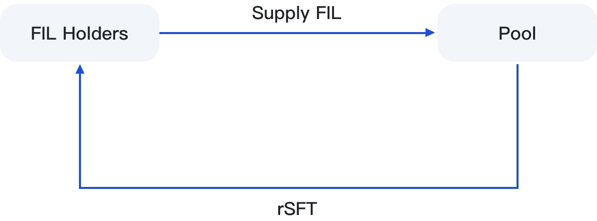

# 🚰 Provide Liquidity


Pool is defined as the liquidity stake and leverage mining liquidity pool launched by SFT Protocol on Filecoin's FVM. It enables FIL token holders to obtain stable income without locking period and provides liquidity lending for FIL demanders.


<figure><figcaption></figcaption></figure>

## 1. Provide

Provide FIL to the Pool liquidity pool, and the provider will enjoy the compound APY income. The range of APY's floating income is between 10% and 58% of the currency-based income, depending on the usage rate of Pool funds.

After the FIL holder provides FIL, the wallet address will receive the LP certificate of rSFT. For example, if 100 FIL is provided, 100 rSFT will be obtained, and the reward earned will be obtained through compound interest calculation.

## 2. Redemption

Users can use rSFT in the Pool pool to redeem FIL in a 1:1 ratio at any time. After redeeming FIL, the contract will destroy rSFT.
