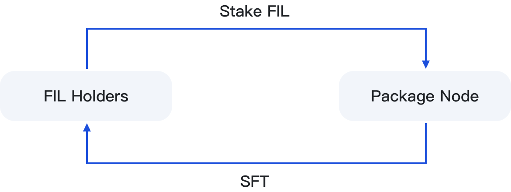

# 🔨 Staking Minting

<figure><figcaption></figcaption></figure>

After the user stakes FIL to the node, the contract automatically casts SFT in a 1:1 ratio. When the user redeems FIL using SFT, the SFT will be destroyed, and the redemption ratio will remain 1:1.

SFT is a certificate of computing power for FIL holders participating in node mining, which will have the right to share in the revenue and redemption of the node. SFT can be transferred through the wallet, and the right to receive income will also be transferred accordingly.
