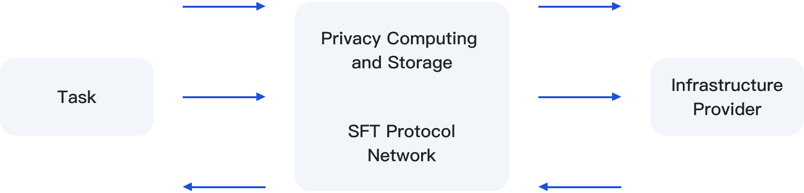

# Technical Architecture

SFT Protocol implements a set of decentralized smart contracts on the Filecoin and BSC blockchains. Smart contracts ensure security without the need for intermediaries.

<figure><figcaption></figcaption></figure>

<figure><figcaption>
SFT Protocol RPC
</figcaption></figure>

<figure><figcaption></figcaption></figure>

<figure><figcaption></figcaption></figure>

<figure><figcaption></figcaption></figure>

<figure><figcaption></figcaption></figure>
