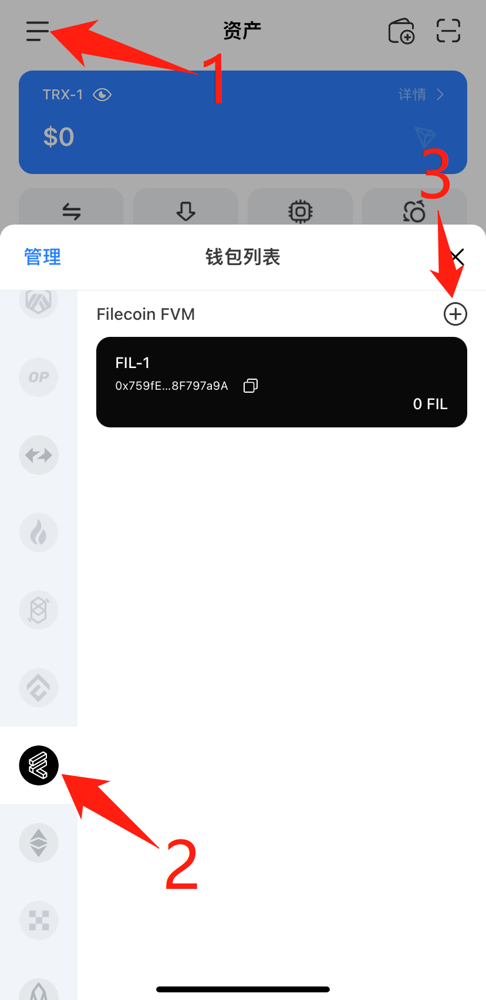
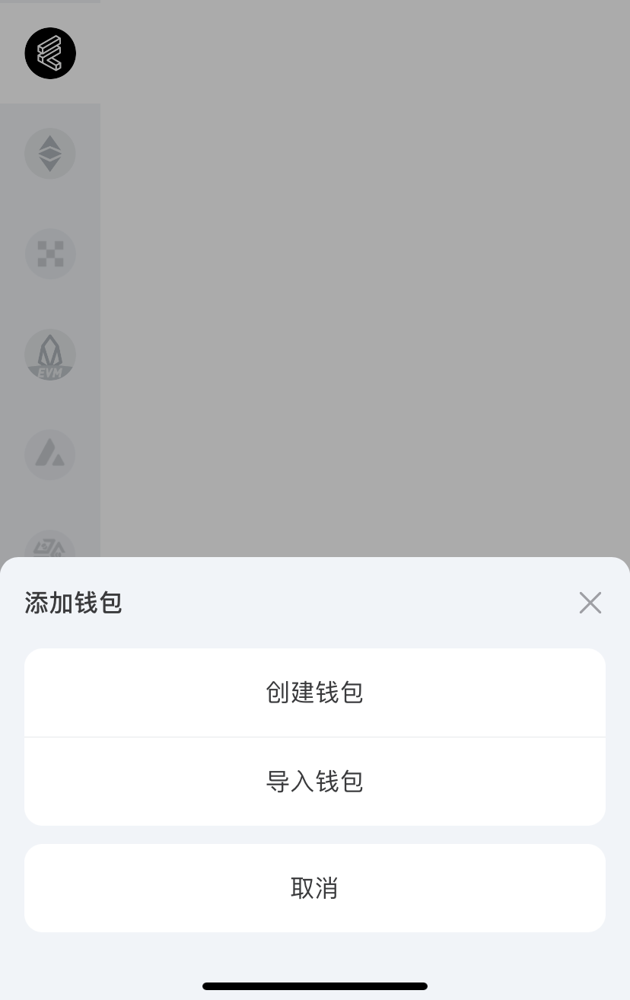
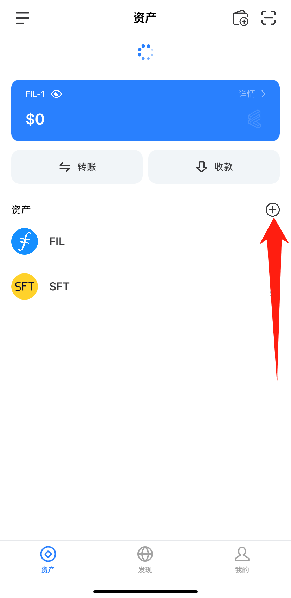
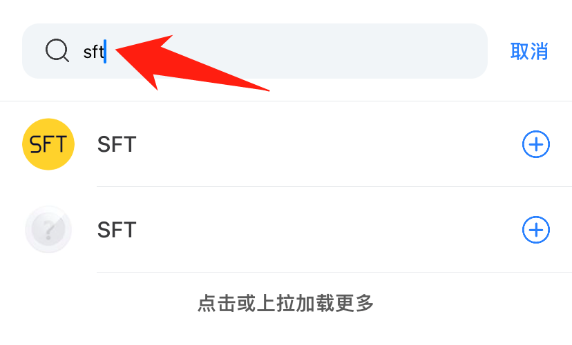
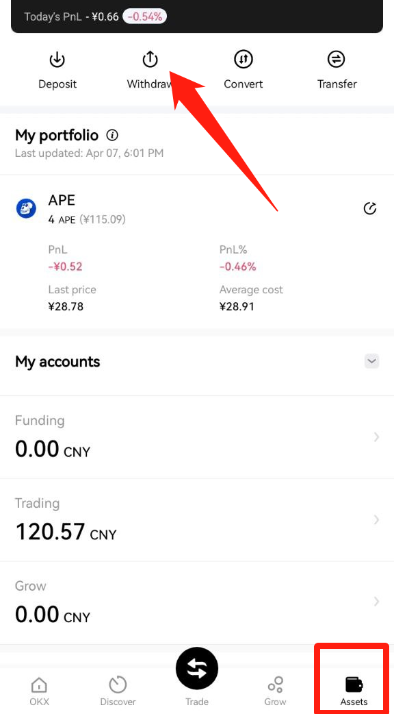
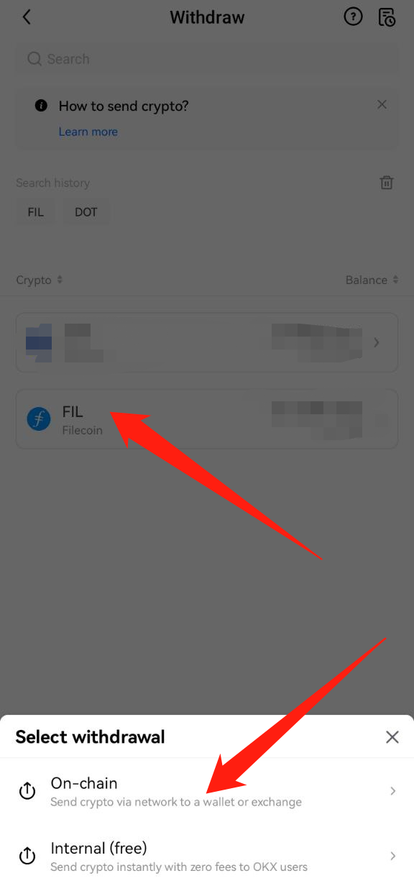

# FVM


TP Wallet是一个流行的去中心化加密钱包，拥有数百万用户。目前该钱包支持Filecoin FVM，用户可使用TP Wallet轻松加入Filecoin 2.0。本教程基于TP Wallet手机版本。


#### 1. Download TP Wallet on your mobile phone: [https://www.tokenpocket.pro/zh/download/app](fvm.md#1.-download-tp-wallet-on-your-mobile-phone-https-www.tokenpocket.pro-zh-download-app-enter-the-downl), enter the [download link](fvm.md#1.-download-tp-wallet-on-your-mobile-phone-https-www.tokenpocket.pro-zh-download-app-enter-the-downl) of the Android or IOS version according to the mobile phone model.

<figure><figcaption></figcaption></figure>

#### 2. Open TP Wallet to switch to the FVM network, create a new wallet or import a wallet.

#### 3. Click the plus sign to add assets to the wallet. Search for SFT and rSPD, and click the plus sign on the right to add them.

 

&#x20;

#### 4. Use the exchange to withdraw FIL to the 0x address of TP Wallet. Filecoin officially supports the list of centralized exchanges, live update: [https://filecointldr.io/get-fil](https://filecointldr.io/get-fil)&#x20;

① For example, buy FIL on the OKX exchange.&#x20;

② After copying the address starting with 0x or f4 in the wallet, refer to the figure below to extract FIL.

 

③ Paste and copy the wallet address starting with 0x or f4, as shown in the figure below.

.png>)

&#x20;④ Follow the exchange steps to confirm the withdrawal to the wallet

#### 5. Use the wallet browser to open the SFT protocol and paste the link: [https://www.sftproject.io/](https://www.sftproject.io/)。

<figure><figcaption></figcaption></figure>

